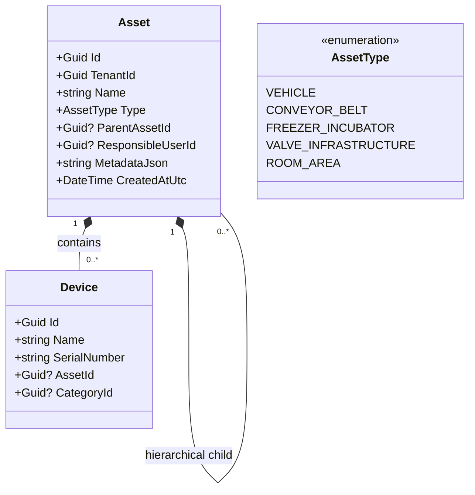

# OmniPulse Sektörel IoT ve Evrensel Varlık (Asset) Stratejisi

Bu doküman, OmniPulse platformunun sadece lojistik ve araç takip odağından çıkarılıp; **Akıllı Fabrikalar, Laboratuvarlar, Akıllı Şehirler ve Akıllı Evler** gibi durağan (stationary) veya farklı hareketli senaryolara nasıl adapte edileceğini analiz eder.

---

## 1. Mevcut Durum ve Sınırlarımız (Gap Analysis)

Mevcut ilişkisel veri tabanımızda (`IoTDbContext`) yer alan modeller lojistik sektörüne sıkı sıkıya bağlıdır:
* `Device` (Sensör) doğrudan bir `Vehicle` (Araç) tablosuna bağlıdır (`VehicleId`).
* `Vehicle` tablosunda `PlateNumber` (Plaka) ve `Brand` (Marka) gibi lojistiğe özel alanlar zorunludur.
* Süreç bir `DriverUserId` (Sürücü) ile eşleşmektedir.

**Sorun:** Bir fabrikaya girdiğimizde araç ve plaka yoktur; konveyör bantları, motorlar veya CNC makineleri vardır. Laboratuvarlarda soğutucu kabinler (Incubator) veya kimyasal odalar; Akıllı Şehirlerde su vanaları, aydınlatma direkleri veya trafolar bulunur. Mevcut mimaride buralardaki sensörleri konumlandıracak genel bir "Varlık" (Asset) kavramı bulunmamaktadır.

---

## 2. Çözüm: "Evrensel Varlık Modeli" (Unified Asset Model - UAM)

Sektörden bağımsız, her türlü cihazı ve operasyonu destekleyebilmek için **`Vehicle`** tablosunu daha genel bir kavram olan **`Asset`** (veya `OperationalAsset`) tablosuna dönüştürmeliyiz.



### Evrensel Model Alanlarının Rolü:
1. **`AssetType` (Enum):** Varlığın türünü belirtir (Araç, Konveyör Bant, Soğutucu, Vana vb.). Arayüz (UI) bu türe göre doğru ikonları (tır, fabrika simgesi, termometre vb.) çizer.
2. **`ParentAssetId` (Hiyerarşi):** Varlıkları iç içe gruplamayı sağlar. Örn: `Fabrika Katı A` (Parent) $\rightarrow$ `Montaj Hattı 2` (Child) $\rightarrow$ `Motor Cihazı` (Grandchild).
3. **`ResponsibleUserId` (Zimmet/Sorumluluk):** 
   * Lojistikte: **Sürücü** (Ahmet Usta)
   * Fabrikada: **Hat Operatörü** (Mehmet Usta)
   * Laboratuvarda: **Laborant** (Canan Hanım)
   * Akıllı Şehirde: **Saha Bakım Teknisyeni** (Ali Usta)
4. **`MetadataJson` (Sektörel Özellikler):** Sektöre özel değişken alanları şema değişikliği yapmadan saklamamızı sağlar:
   * Araç için: `{"plateNumber": "34ABC123", "brand": "Scania", "payloadCapacity": "20tons"}`
   * Fabrika için: `{"rpmLimit": 1500, "voltageRequirement": "380V", "maintenanceIntervalDays": 90}`
   * Laboratuvar için: `{"cabinetNumber": "Fridge-04", "calibrationDate": "2026-05-12"}`

---

## 3. Sektörel Senaryoların Karşılaştırmalı Analizi

Evrensel Varlık yapısı kurulduğunda, sistemimizin farklı sektörlerde nasıl çalışacağına dair detaylı eşleşmeler aşağıdadır:

| Sektör / Senaryo | Varlık (Asset) | Sorumlu Kişi | Örnek Sensör (Device) | Kritik Telemetri Değeri | Tetiklenecek Görev (WorkflowTask) |
| :--- | :--- | :--- | :--- | :--- | :--- |
| **Soğuk Zincir Lojistiği** | Araç (Vehicle) | Sürücü (Ahmet Usta) | Sıcaklık & GPS Sensörü | Sıcaklık > -18°C (Dondurma eriyor) | "Dondurmaları depoya geri götür, soğutucuyu kontrol et." |
| **Akıllı Fabrika** | Konveyör Bant / CNC | Hat Operatörü (Mehmet) | Titreşim & Isı Sensörü | Titreşim > 8.0G (Rulman aşınmış) | "Bant-3 motorunu durdur, rulmanı değiştir." |
| **Kimya Laboratuvarı** | İnkübatör (Freezer) | Laborant (Canan Hanım) | Sıcaklık & Kapak Durumu | Kapak Açık Süresi > 5 dk | "İlaç dolabının kapağını kapat ve numuneleri kontrol et." |
| **Akıllı Şehir** | Su Dağıtım Vanası | Saha Teknisyeni (Ali) | Basınç Sensörü | Basınç < 1.5 Bar (Boru patlak) | "Vana-12'yi kapat, acil ekipleri bölgeye sevk et." |
| **Akıllı Ev** | Oturma Odası / Kombi | Ev Sahibi / Kiracı | Gaz & Duman Sensörü | Duman Seviyesi > Eşik | "Kombiyi kapat, gaz vanasını kilitle, itfaiyeyi ara." |

---

## 4. "Sürücü" (Driver) Akışından "Evrensel Operatör" Akışına Geçiş

Şu anki sürücü odaklı `ApplyDriverFilter` ve `GetTelemetryReportQueryHandler` içindeki lojistik kontrollerini tamamen **`Asset` bazlı yetkilendirmeye** çevireceğiz:

```csharp
// Sürücü filtresi yerine "Varlık Yetki Filtresi" (Asset-Based Access Control - ABAC)
public static IQueryable<Telemetry> ApplyAssetFilter(
    this IQueryable<Telemetry> query, 
    IUserTenantContext userTenantContext)
{
    // Kullanıcı rolü "FieldWorker" (Saha Çalışanı / Sürücü / Operatör) ise
    // sadece sorumlu olduğu varlıkların (Assets) telemetrilerini görebilir.
    if (userTenantContext.Roles.Contains("FieldWorker", StringComparer.OrdinalIgnoreCase))
    {
        Guid userId = Guid.Parse(userTenantContext.UserId);
        return query.Where(t => t.Device.Asset != null && t.Device.Asset.ResponsibleUserId == userId);
    }
    return query;
}
```

---

## 5. Ne Yapacağız? Yol Haritamız Hazır mı?

Evet, bu senaryoların tamamına mimari olarak hazırız. Yapmamız gereken değişiklikler sırasıyla şunlardır:

1. **Veri Tabanı Dönüşümü (EF Core Migration):**
   * `Vehicle` tablosunu `Asset` olarak yeniden adlandıracağız (Rename).
   * `PlateNumber` ve `Brand` alanlarını `MetadataJson` içine taşıyacağız.
   * `AssetType` (Enum) ve `ParentAssetId` (Hiyerarşi) alanlarını ekleyeceğiz.
   * `Device.VehicleId` alanını `Device.AssetId` olarak güncelleyeceğiz.
2. **Kod Refaktörü:**
   * Projedeki `Vehicle` isimlendirmelerini `Asset` olarak güncelleyeceğiz.
   * Rollerdeki "Driver" ifadesini, fabrika operatörü ve saha mühendisini de kapsayan "FieldWorker" (Saha Çalışanı) veya "Operator" rolüyle birleştireceğiz.
3. **Kinesis ve Cosmos DB Entegrasyonu:**
   * AWS Kinesis'ten akan veri paketini çözen yapı, gelen sensörün hangi `Asset`'e bağlı olduğunu Postgres'ten (önbellek yardımıyla) bulup, Cosmos DB'de o `Asset` adına görev (`WorkflowTask`) açacak.
