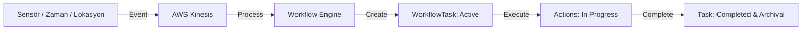

# OmniPulse Görev Odaklı (Task-Based) İş Akışı Mimari Planı

Bu doküman, OmniPulse platformunun sadece cihaz/stok takibi yapan pasif bir sistemden, farklı sektörlere (Lojistik, Akıllı Fabrika, Akıllı Şehir vb.) uyarlanabilir **Olay Güdümlü ve Görev Odaklı bir Operasyon Yönetim Sistemi (Event-Driven Task Engine)** haline getirilmesi için hazırlanan mimari yol haritasıdır.

---

## 1. Mimari Felsefe: "Task-Based Architecture"

Klasik veri tabanı tasarımları durumları (state) anlık olarak tutar (Örn: "Cihaz Sıcaklığı: 24°C" veya "Araç Konumu: X Eczanesi"). Görev Odaklı Mimari ise bu durum değişimlerini birer **eylem çağrısı (Actionable Event)** olarak ele alır ve çözülmesi gereken dinamik görevler (`WorkflowTask`) oluşturur.

> [!IMPOR[asset_refactoring_plan.md](asset_refactoring_plan.md)TANT]
> **Evrensel Kural:** Ahmet Usta taşıdığı kutunun amacını (teslimat mı iade mi) önemsemez; o an aracında aktif olan yükün fiziksel sağlığıyla (telemetrisiyle) ilgilenir. Benzer şekilde, bir fabrika operatörü de robot kolunun bakım talebini bir "aktif görev" olarak görür.



---

## 2. Modüler Yapı: `WorkflowModule`

Bu sistem, mimarinin bağımsızlığını ve modülerliğini korumak amacıyla `TenantModule` veya `IoTModule` içine gömülmek yerine `/src/OmniPulse.Workflow` altında **tamamen izole bir modül** olarak kurgulanacaktır.

### Modül Sınırları ve İletişim

* **Giriş (Inbound):** `WorkflowModule`, diğer modüllerden (örn: `IoTModule`'ün `AlarmService` yapısı) veya dış kuyruklardan (`AWS Kinesis`) gelen olayları dinler.
* **Bağımlılık (Dependency):** Modül, kimlik doğrulama ve kullanıcı yetkilendirmesi için `TenantModule`'ün kontratlarını tüketir, ancak doğrudan veritabanı tablolarına dokunmaz.
* **Çıkış (Outbound):** Görevler tamamlandığında veya durum değiştirdiğinde SignalR (`AlarmHub` benzeri bir yapı) üzerinden istemcilere anlık bildirim fırlatır.

---

## 3. Veri Modellemesi: Cosmos DB (NoSQL) Doküman Yapısı

Görevler son derece dinamik olduğu ve sektöre göre (lojistik adımları, fabrika bakım check-list'leri vb.) farklı alt kırılımlar içerebileceği için bu verileri **Cosmos DB** üzerinde şemasız (schema-less) dokümanlar halinde tutacağız.

### `WorkflowTask` JSON Taslağı

```json
{
  "id": "task_2026_06_21_9912a",
  "tenantId": "e2b83d8b-4b10-449e-b9ad-83bc70104192",
  "targetContext": {
    "type": "Vehicle", 
    "id": "plate_34ABC123",
    "displayName": "Ahmet Usta - 34 ABC 123"
  },
  "assignedUserId": "driver_ahmet_usta_01",
  "type": "LOGISTICS_TRANSFER",
  "status": "InTransit",
  "createdAt": "2026-06-21T00:30:00Z",
  "completedAt": null,
  "items": [
    {
      "itemId": "item_icecream_abc",
      "name": "Dondurma Kutusu A (İade)",
      "sensorSerialNumber": "SN-TEMP-9988",
      "requiredMetric": {
        "key": "Temperature",
        "operator": "LessThan",
        "threshold": -18.0
      }
    },
    {
      "itemId": "item_medicine_xyz",
      "name": "Soğuk Zincir İlaç B (Teslimat)",
      "sensorSerialNumber": "SN-TEMP-4455",
      "requiredMetric": {
        "key": "Temperature",
        "operator": "Range",
        "min": 2.0,
        "max": 8.0
      }
    }
  ],
  "pendingActions": [
    {
      "actionId": "action_01",
      "type": "UNLOAD",
      "targetLocation": "Kadıköy Depo",
      "targetItemId": "item_icecream_abc",
      "description": "Dondurmayı depoya iade et."
    },
    {
      "actionId": "action_02",
      "type": "DELIVER",
      "targetLocation": "Moda Eczanesi",
      "targetItemId": "item_medicine_xyz",
      "description": "İlacı eczaneye teslim et."
    }
  ]
}
```

---

## 4. Olay Akışı ve AWS Kinesis Entegrasyonu

Veri akışını tamamen asenkronize etmek ve sistemi yüksek yük altında (saniyede binlerce telemetri verisinde) tıkanmayacak şekilde kurgulamak için araya **AWS Kinesis Data Streams** entegre edilecektir.

### Akış Senaryosu

1. **Veri Üretimi:** Cihazlar telemetri verilerini `IngestTelemetry` endpoint'ine gönderir.
2. **Kinesis Akışı:** Gelen telemetriler anında AWS Kinesis stream'ine yazılır.
3. **Değerlendirme:** Arka planda çalışan bir worker (örn: AWS Lambda veya .NET Kinesis Consumer Service) verileri Kinesis'ten çeker ve kurallarla karşılaştırır.
4. **Reaksiyon:** Eğer kritik bir durum (eşik aşımı, alarm durumu veya lokasyona varış) saptanırsa, bu worker Cosmos DB'de yeni bir `WorkflowTask` oluşturur veya mevcut olanı günceller.
5. **Arayüz Tetikleme:** Değişen veri, SignalR kanalıyla sürücü veya operatör ekranına yansıtılır.

---

## 5. Tasarlanacak API Uçları (REST Endpoints)

`WorkflowModule` aktif hale geldiğinde aşağıdaki uçları sunacaktır:

| Metot | Endpoint | Açıklama | Sorumlu Rol |
| :--- | :--- | :--- | :--- |
| **GET** | `/api/workflow/tasks/active` | Sürücünün/Operatörün o anki aktif yüklerini ve görevlerini getirir. | Sürücü, Operatör |
| **POST** | `/api/workflow/tasks` | Yeni bir iş akışı/görev tanımlar (manuel veya sistem tetikli). | Yönetici, Sistem |
| **POST** | `/api/workflow/tasks/{id}/actions/{actionId}/complete` | Belirli bir atomik aksiyonu tamamlandı olarak işaretler. | Sürücü, Operatör |
| **POST** | `/api/workflow/tasks/{id}/complete` | Tüm görevi tamamlar ve arayüz listesinden kaldırır (arşive çeker). | Sürücü, Operatör |

---

## 6. Yol Haritası ve Uygulama Adımları

* [ ] **Faz 1: Modülün Altyapısı ve Cosmos DB Katmanı**
  * `WorkflowModule` projesinin oluşturulması.
  * Cosmos DB bağlantılarının yapılması ve `WorkflowTask` şemasının C# sınıfları olarak modellenmesi.
* [ ] **Faz 2: API Katmanı ve İş Kuralları**
  * Görev oluşturma, aksiyon tamamlama API uçlarının yazılması.
  * Aktif görevleri listelerken, ilişkisel DB'deki (Postgres) güncel telemetrileri Cosmos verileriyle birleştiren hibrit (CQRS) sorguların yazılması.
* [ ] **Faz 3: AWS Kinesis Entegrasyonu**
  * Kinesis Stream bağlantısının kurulması.
  * `IngestTelemetry` akışının Kinesis'e yönlendirilmesi ve Consumer worker yazımı.
  * AWS Kinesis Data Streams ve local stack testlerinin yapılması.
* [ ] **Faz 4: Arayüz (omnipulse-ui) Geliştirmesi**
  * Ahmet Usta ve operatörler için bu genel iş akışlarını listeleyen dinamik arayüz kartlarının hazırlanması.
